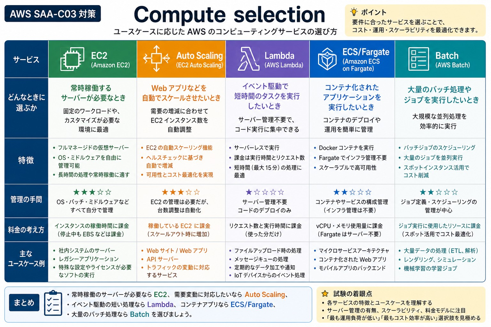
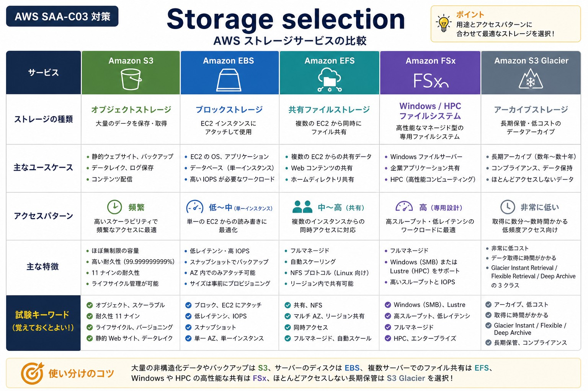
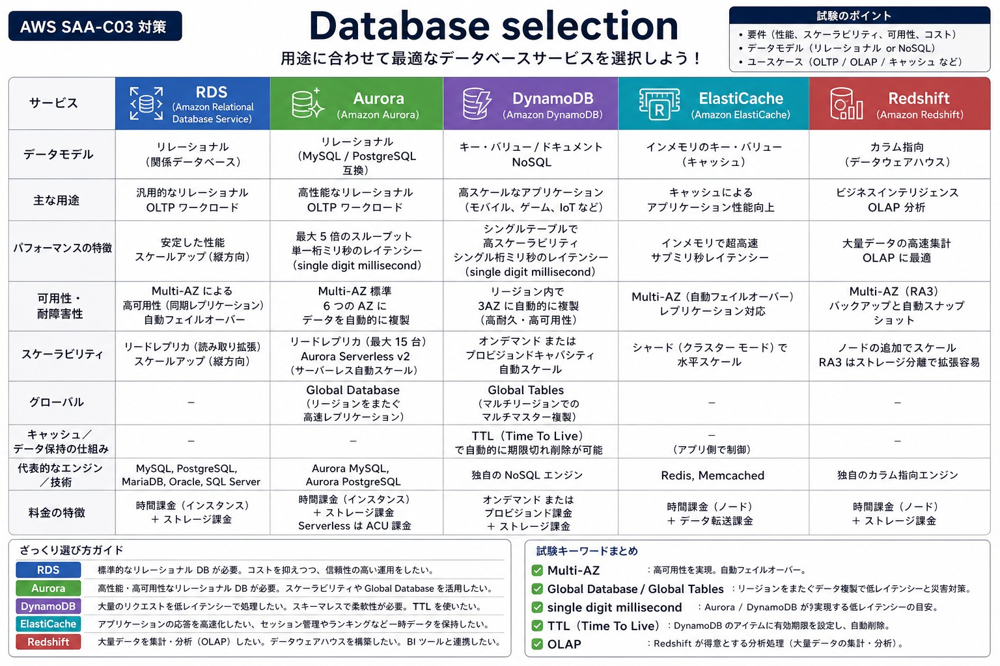
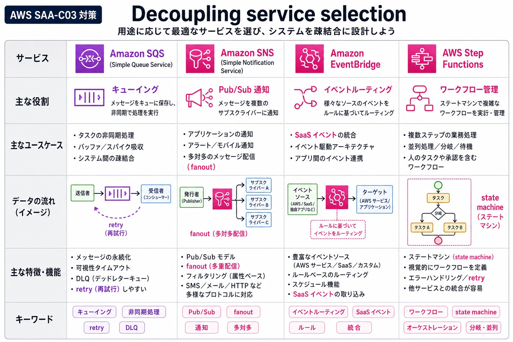
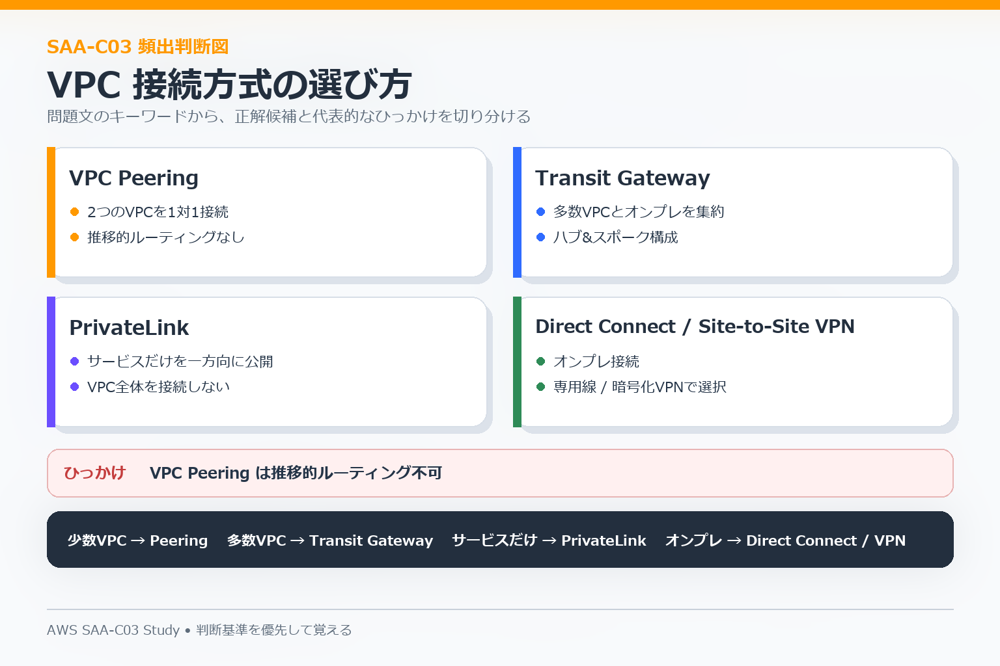
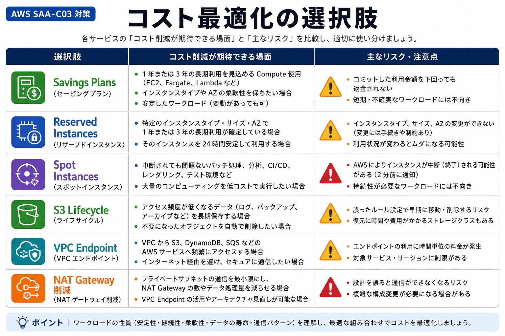

# 02 サービス選択

SAA-C03では、似たAWSサービスの中から**問題文の要件に合うものを選ぶ**力が重要です。ここでは分野をまたいで、選択の軸だけをまとめます。

## Compute

| サービス | 選ぶ場面 |
|---|---|
| EC2 | OSやミドルウェアまで細かく管理したい仮想サーバー |
| Lambda | イベント駆動の短時間処理、サーバー管理を減らしたい |
| ECS / Fargate | コンテナを使い、Kubernetes指定がない |
| EKS | Kubernetesが要件にある |
| ALB | HTTP / HTTPSを内容に応じて分散する |
| NLB | TCP / UDP、固定IP、高スループットを重視する |

**判断軸:** サーバーを自分で管理するか、イベント駆動か、コンテナか、Kubernetesが必要か。

## Storage

| サービス | 選ぶ場面 |
|---|---|
| S3 | オブジェクト、画像、ログ、バックアップ、静的コンテンツ |
| EBS | EC2に接続するブロックストレージ |
| EFS | 複数のLinux系インスタンスから共有するファイルシステム |
| FSx for Windows File Server | Windowsファイル共有 |
| FSx for Lustre | HPCなど高性能な共有ファイル処理 |
| DataSync | 大量データの移行・転送 |
| Storage Gateway | オンプレミスとAWSストレージを連携 |

**判断軸:** オブジェクトか、EC2用ディスクか、複数台共有か、Windows / HPC固有要件があるか。

## Database

| サービス | 選ぶ場面 |
|---|---|
| RDS | 一般的なリレーショナルデータベース |
| Aurora | MySQL / PostgreSQL互換で高性能・高可用性を重視 |
| DynamoDB | 大規模なKey-Value / NoSQL、低レイテンシ |
| DAX | DynamoDBの読み取りを高速化 |
| ElastiCache | キャッシュでデータベース負荷を減らす |
| Redshift | データウェアハウス、分析 |
| Athena | S3上のデータをSQLで直接分析 |
| OpenSearch | 検索・ログ分析 |
| Neptune | グラフデータベース |

**判断軸:** RDB、NoSQL、キャッシュ、分析、検索、グラフのどれを求めているか。

## Application Integration

| サービス | 選ぶ場面 |
|---|---|
| SQS | 処理をキューにためて非同期化する |
| SNS | 1つのイベントを複数の購読先へ通知する |
| EventBridge | AWSサービスやSaaSのイベントをルールで振り分ける |
| Step Functions | 複数処理の順序、分岐、再試行、状態を管理する |
| Kinesis | リアルタイムのストリーミングデータを扱う |
| API Gateway | APIを公開・管理する |

**判断軸:** キュー、通知、イベントルーティング、ワークフロー、ストリーミングを混同しない。

## Network / Global Delivery

| サービス | 選ぶ場面 |
|---|---|
| CloudFront | Webコンテンツをエッジ配信・キャッシュする |
| Route 53 | DNS、ヘルスチェック、名前解決ベースの振り分け |
| Global Accelerator | TCP / UDPをAWSグローバルネットワークで最適化する |
| VPC Peering | 少数VPCを1対1で接続する |
| Transit Gateway | 多数のVPCやVPN接続をハブへ集約する |
| VPC Endpoint | AWSサービスへプライベートに接続する |
| PrivateLink | サービスをVPC間でプライベート公開・利用する |
| Direct Connect | オンプレミスとAWSを専用線で接続する |
| Site-to-Site VPN | インターネット経由の暗号化された拠点間接続 |

**判断軸:** 配信、DNS、通信経路最適化、VPC間接続、AWSサービスへのプライベート接続、オンプレ接続を分ける。

## Cost

| サービス / 機能 | 選ぶ場面 |
|---|---|
| On-Demand | 短期、利用量が読めない |
| Savings Plans | 長期的に安定したCompute利用 |
| Reserved Instances | 対象サービスの長期安定利用 |
| Spot Instances | 中断されてもよい処理 |
| S3 Intelligent-Tiering | アクセス頻度が読めない |
| S3 Glacier系 | 長期保管・アーカイブ |
| Cost Explorer | コストを分析する |
| AWS Budgets | 予算を監視・通知する |
| Compute Optimizer | リソースサイズの最適化候補を確認する |

**判断軸:** 購入オプション、保存期間、アクセス頻度、データ転送、過剰構成を確認する。

## 最後に迷いやすい組み合わせ

- **RDS Multi-AZ vs Read Replica**: 可用性か、読み取り性能か。
- **CloudFront vs Global Accelerator vs Route 53**: キャッシュか、通信経路か、DNS判断か。
- **SQS vs SNS vs EventBridge vs Step Functions**: キューか、通知か、イベント振り分けか、処理手順か。
- **S3 vs EBS vs EFS vs FSx**: オブジェクトか、ブロックか、共有ファイルか、固有ファイル要件か。
- **Security Group vs NACL**: リソース側のステートフル制御か、サブネット側のステートレス制御か。
- **NAT Gateway vs VPC Endpoint**: 一般インターネットへ出たいのか、AWSサービスへプライベート接続したいのか。

迷ったときは「どのサービスが高機能か」ではなく、**問題文が何を最優先しているか**で選びます。
