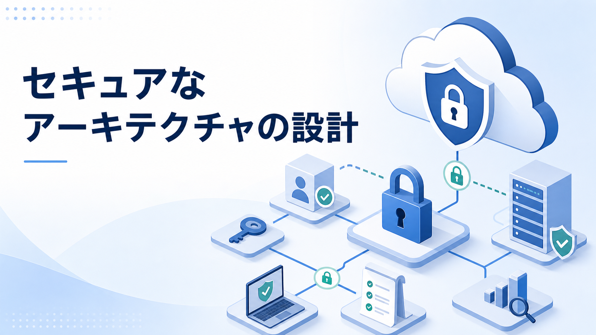
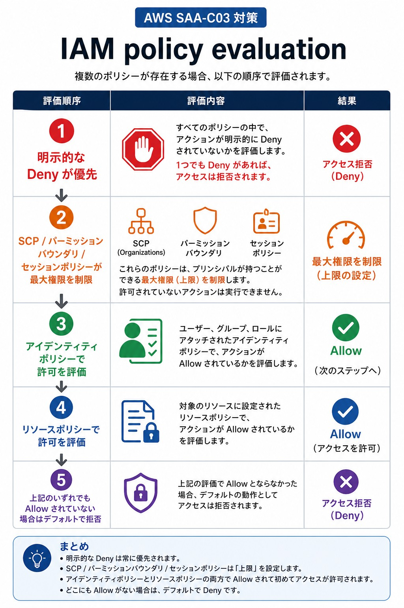
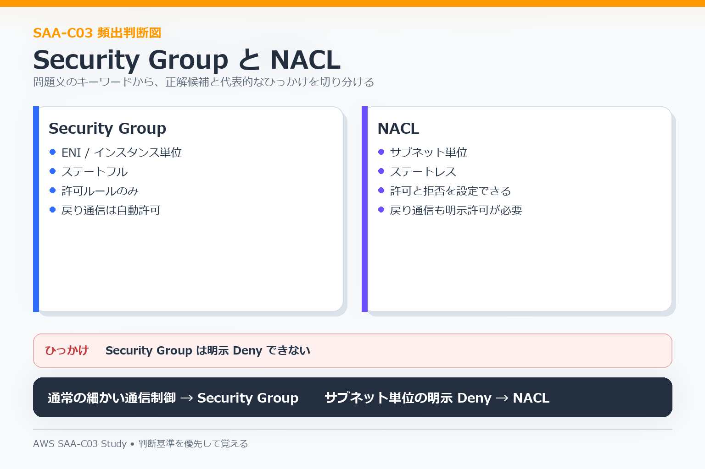
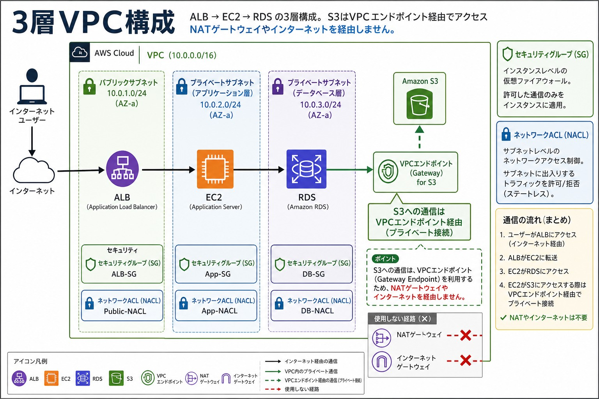
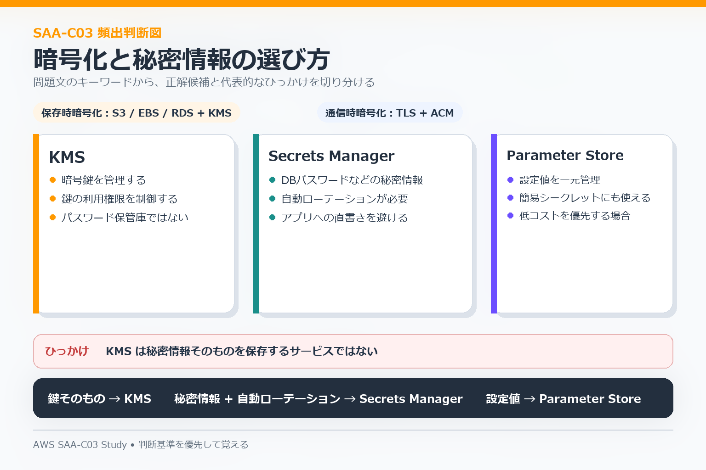

# 03 Secure Architectures

この分野では、**誰に何を許可するか、通信をどこで制御するか、データをどう保護するか**を判断します。

## IAMと権限

| 要件 | 主な候補 |
|---|---|
| 人間が複数AWSアカウントへアクセス | IAM Identity Center |
| EC2やLambdaへ権限を渡す | IAM role |
| 別アカウントへ一時アクセス | Cross-account role |
| リソース側で許可を定義 | S3 bucket policyなどのresource policy |
| Organizations全体で権限上限を制御 | SCP |
| 一時認証情報を発行 | STS |

基本は**長期アクセスキーを配るより、一時的な認証情報とIAM roleを使う**方向で考えます。

### Policy評価

1. 明示的なDenyがあれば拒否される。
2. Allowがなければ許可されない。
3. SCPやpermissions boundaryなどは、付与済み権限の上限を制限する。
4. Identity policyとresource policyの両方が関係するケースがある。

## Security GroupとNACL

| 項目 | Security Group | NACL |
|---|---|---|
| 適用単位 | ENI / インスタンス側 | サブネット |
| 状態 | ステートフル | ステートレス |
| 明示Deny | なし | あり |
| 主な用途 | 通常のリソース単位通信制御 | サブネット単位の粗い制御 |

Security Groupは戻り通信を自動的に扱います。NACLは戻り側の通信もルールで考える必要があります。

## VPC内で安全に配置する

一般的な3層構成では、公開が必要なロードバランサーと、外部公開する必要がないアプリ・データベースを分けます。

- ALB: public subnet
- Application servers: private subnet
- Database: private subnet
- S3 / DynamoDBへのプライベート通信: VPC Endpointを検討

## 暗号化と秘密情報

| 要件 | 主な候補 |
|---|---|
| 暗号鍵を管理 | KMS |
| TLS証明書を管理 | ACM |
| DBパスワードなどを保存・ローテーション | Secrets Manager |
| 設定値や簡易な秘密情報を管理 | Systems Manager Parameter Store |
| S3の機密情報を検出 | Macie |

**保存時暗号化**と**通信時暗号化**を分けて考えます。秘密情報をアプリケーションコードへ直接埋め込む選択肢は避けます。

## 脅威・Web・監査

| サービス | 主な役割 |
|---|---|
| WAF | HTTP / HTTPSレベルのWeb攻撃対策 |
| Shield | DDoS対策 |
| GuardDuty | 脅威検出 |
| Macie | S3の機密データ検出 |
| CloudTrail | API操作履歴の監査 |
| AWS Config | リソース設定の記録・準拠評価 |

## よくある判断

- EC2からS3へ安全にアクセス → IAM role + 必要に応じてVPC Endpoint / bucket policy。
- データベース認証情報を管理 → Secrets Manager。
- 複数AWSアカウントの人間ユーザー → IAM Identity Center。
- 組織全体で禁止事項を設ける → SCP。
- SQL injectionなどWebリクエストを遮断 → WAF。
- S3内の個人情報・機密情報を発見 → Macie。
- 不審なAWSアクティビティを検出 → GuardDuty。

## 混同しやすい点

- SCPは権限を新しく付与する仕組みではない。
- Security GroupとNACLは適用単位と状態管理が違う。
- KMSは鍵管理、Secrets Managerは秘密情報管理。
- GuardDutyは検出が中心で、通信を直接遮断するサービスではない。
- CloudTrailは操作履歴、AWS Configは構成状態・準拠性を確認する。

次は [04 Resilient Architectures](./04-resilient-architectures.md) へ進みます。
