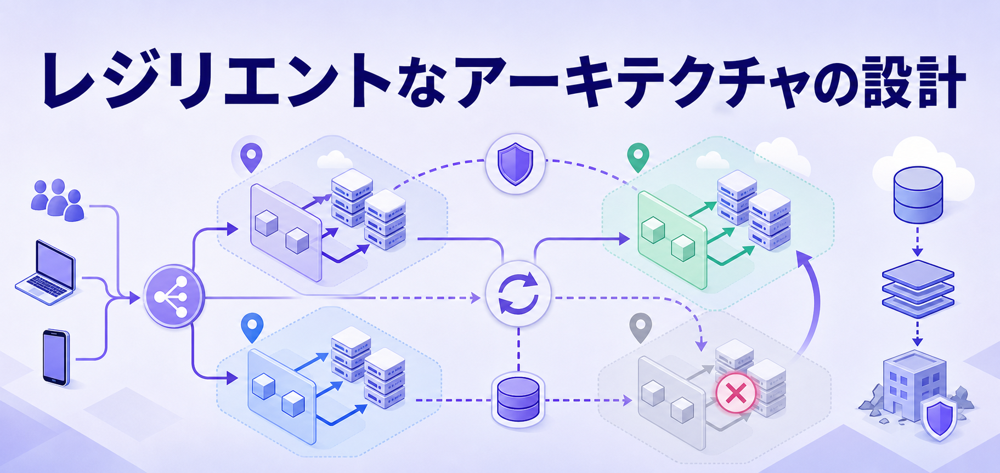
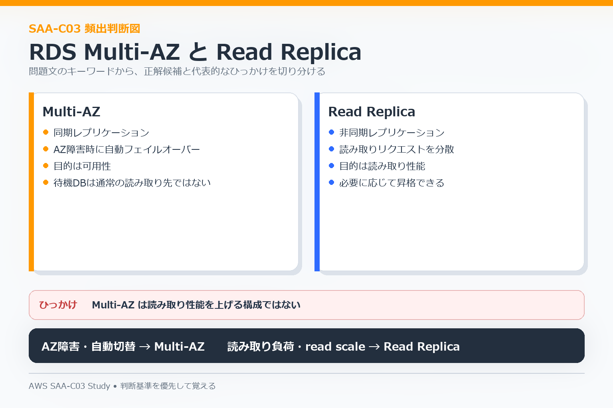
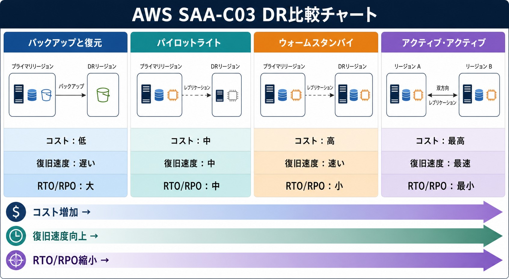

# 04 Resilient Architectures

この分野では、**障害が起きてもサービスを継続・復旧できる構成**を選びます。単一障害点、Multi-AZ、DR、疎結合が中心です。

## 高可用性の基本

- 1台のEC2だけに依存しない。
- 複数AZへ分散する。
- ELBで正常なインスタンスへ振り分ける。
- Auto Scalingで必要な台数を維持する。
- データベースは可用性要件と性能要件を分ける。

## RDS Multi-AZとRead Replica

| 要件 | 選ぶもの |
|---|---|
| AZ障害に備えたい | RDS Multi-AZ |
| 読み取り負荷を分散したい | Read Replica |
| バックアップから復旧したい | Snapshot / AWS Backup |
| 複数リージョンでAuroraを利用したい | Aurora Global Databaseなどを検討 |

「自動フェイルオーバー」「AZ障害」が中心なら可用性、「読み取りが多い」が中心ならread scalingを優先して考えます。

## 疎結合

同期処理が強く結び付いていると、一部の障害が全体へ広がりやすくなります。

| 要件 | 主な候補 |
|---|---|
| 処理をキューへためる | SQS |
| 1つのイベントを複数へ通知 | SNS |
| イベントを条件で振り分ける | EventBridge |
| 複数処理の順序・分岐・再試行を管理 | Step Functions |

SQSはproducerとconsumerの処理速度が違う場合にも有効です。順序保証などが要件にある場合はStandardとFIFOの違いも確認します。

## RPOとRTO

- **RPO**: どの時点までデータを戻せればよいか。許容できるデータ損失量に関係する。
- **RTO**: どれだけの時間でサービスを復旧させる必要があるか。

復旧を速くするほど、一般に常時用意しておくリソースが増え、コストも上がります。

## DR戦略

| 戦略 | 平常時 | 復旧の特徴 |
|---|---|---|
| Backup and Restore | バックアップ中心 | 低コストだが復旧は遅い |
| Pilot Light | 中核コンポーネントだけ稼働 | 障害時にアプリ側を立ち上げる |
| Warm Standby | 小さい本番環境が稼働 | スケールして切り替える |
| Active-Active | 複数環境が本番稼働 | 速い切り替えが可能だが高コスト |

問題文ではRPO / RTOだけでなく、**コスト制約**も同時に確認します。

## データ保護

- S3 Versioning: 誤削除や上書きへの備え。
- AWS Backup: 複数AWSサービスのバックアップをまとめて管理。
- Snapshot: 特定時点の復元に利用。
- Cross-Region構成: リージョン障害まで対象にする場合に検討。

## よくある判断

- 単一EC2で稼働 → ALB + Auto Scaling + 複数AZを検討。
- RDSのAZ障害対策 → Multi-AZ。
- 読み取り負荷増加 → Read Replica。
- 処理失敗が後続処理まで止める → SQSなどで非同期化。
- 複数の処理へ同じイベントを配る → SNSやEventBridgeを検討。
- 短いRTOを求めるDR → Warm StandbyやActive-Activeを比較。

## 混同しやすい点

- Multi-AZとRead Replicaは主目的が違う。
- Multi-Regionは強力だが、常に最適とは限らない。
- Backup and RestoreとWarm Standbyでは平常時に動いている構成が大きく違う。
- SQS、SNS、EventBridge、Step Functionsはすべて「連携」に見えるが役割が違う。

次は [05 High-Performing Architectures](./05-high-performing-architectures.md) へ進みます。
