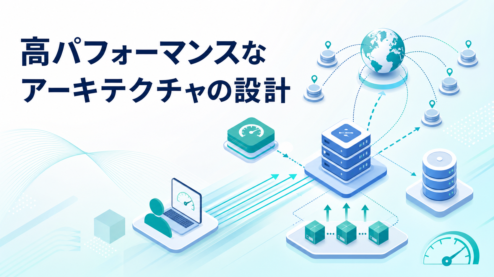
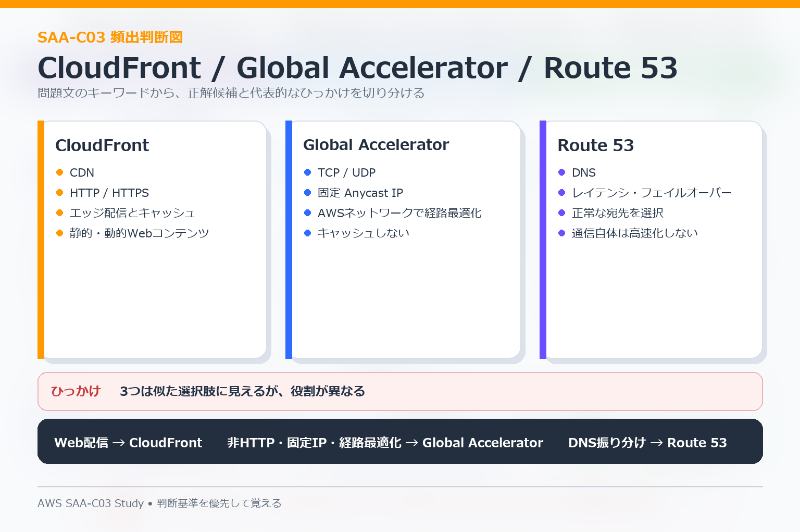

# 05 High-Performing Architectures

この分野では、**処理方式・ストレージ・データベース・ネットワークを性能要件に合わせて選ぶ**ことが中心です。

## 性能要件を分ける

問題文でまず確認するのは次です。

- レイテンシを下げたいのか。
- スループットを上げたいのか。
- 読み取り負荷を減らしたいのか。
- グローバルユーザーへの配信を速くしたいのか。
- 共有ファイルが必要なのか。
- 大量データを分析したいのか。

## Storage

| 要件 | 主な候補 |
|---|---|
| オブジェクト、画像、ログ、バックアップ | S3 |
| EC2に接続するディスク | EBS |
| 複数Linux系インスタンスで共有 | EFS |
| Windowsファイル共有 | FSx for Windows File Server |
| HPC向け高性能ファイル | FSx for Lustre |

データ形式と共有要件を先に決めると候補を絞りやすくなります。

## Database

| 要件 | 主な候補 |
|---|---|
| 一般的なRDB | RDS |
| MySQL / PostgreSQL互換で高性能・高可用 | Aurora |
| 大規模Key-Value / NoSQL | DynamoDB |
| DynamoDB読み取り高速化 | DAX |
| キャッシュ | ElastiCache |
| S3上のデータをSQL分析 | Athena |
| データウェアハウス | Redshift |
| 検索・ログ分析 | OpenSearch |
| グラフデータ | Neptune |

「データベース」という言葉だけでRDSを選ばず、データモデルとアクセスパターンを確認します。

## Cacheとread scaling

読み取りがボトルネックの場合、候補は1つではありません。

- RDS / Auroraの読み取り分散 → Read Replica。
- アプリケーションの頻繁な読み取り結果 → ElastiCache。
- DynamoDBの読み取り高速化 → DAX。
- Webコンテンツのエッジキャッシュ → CloudFront。

どの層の読み取りを減らしたいかで選びます。

## Global Delivery

| サービス | 主な役割 |
|---|---|
| CloudFront | Webコンテンツをエッジで配信・キャッシュ |
| Global Accelerator | TCP / UDPをAWSグローバルネットワークで最適化 |
| Route 53 | DNSで接続先を選択 |

3つは似た「グローバル」サービスに見えますが、**キャッシュ、通信経路、DNS**という別の役割です。

## Compute

- OSやミドルウェアまで管理したい → EC2。
- イベント駆動でサーバー管理を減らしたい → Lambda。
- コンテナを動かしたい → ECS / Fargate。
- Kubernetesが明示されている → EKS。
- HTTP / HTTPSを内容に応じて分散 → ALB。
- TCP / UDP、高スループット、固定IP要件 → NLB。

## よくある判断

- 静的コンテンツを世界へ高速配信 → S3 + CloudFront。
- 複数EC2で同じファイルを共有 → EFS。
- DynamoDBの読み取りを高速化 → DAX。
- 大量ログをS3へ保存してSQL分析 → Athena。
- 大規模な分析処理 → Redshiftを検討。
- TCP / UDP通信をグローバルに最適化 → Global Acceleratorを検討。

## 混同しやすい点

- EBSとEFSは「EC2で使うストレージ」でも共有方法が違う。
- RDS Multi-AZは可用性が主目的で、Read Replicaは読み取り性能が主目的。
- CloudFrontとGlobal Acceleratorは最適化する層が違う。
- DynamoDBにRDBと同じ複雑なJOINを前提とした設計を持ち込まない。
- Kubernetes指定がないのにEKSを選ぶと、要件に対して運用負荷が過剰な場合がある。

次は [06 Cost-Optimized Architectures](./06-cost-optimized-architectures.md) へ進みます。
