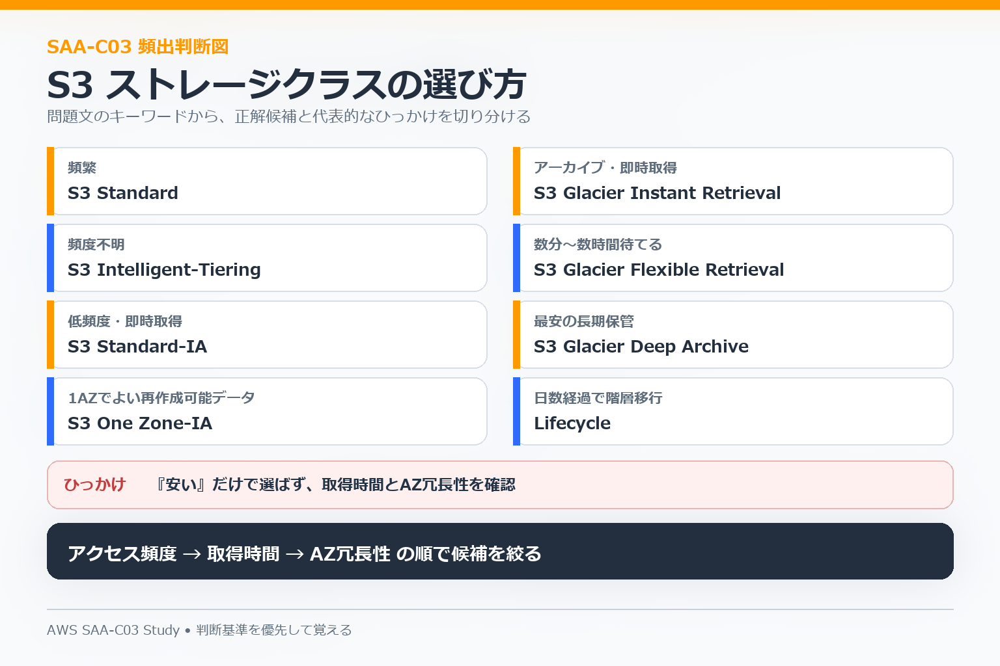
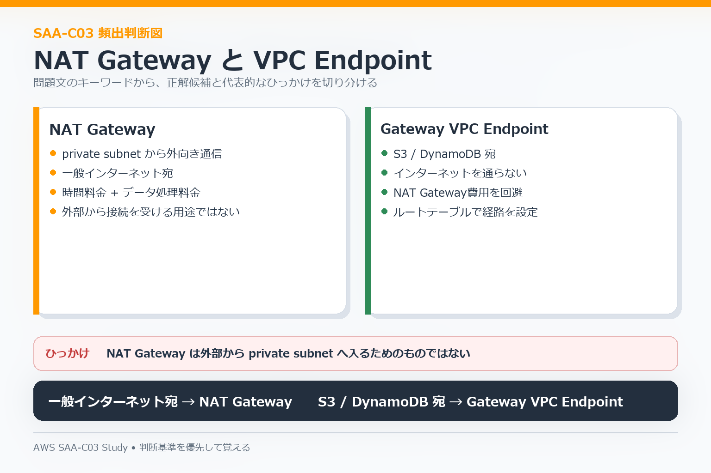

# 06 Cost-Optimized Architectures

この分野では、**必要な要件を満たしたうえで、過剰な構成・購入方法・保存方法・通信経路を見直す**ことが中心です。

## Computeの購入オプション

| 要件 | 主な候補 |
|---|---|
| 短期、利用量が予測しにくい | On-Demand |
| 長期的に安定したCompute利用 | Savings Plans |
| 対象サービスを長期利用 | Reserved Instances |
| 中断されてもよいバッチ処理 | Spot Instances |
| ライセンスや専有ホスト要件 | Dedicated Hostなど |

安さだけでSpotを選ばず、**中断を許容できるか**を確認します。

## S3ストレージクラス

| 要件 | 主な候補 |
|---|---|
| 頻繁にアクセス | S3 Standard |
| アクセス頻度が読めない | S3 Intelligent-Tiering |
| 低頻度だがすぐ取り出す | S3 Standard-IA |
| 1AZ保存でよい低頻度データ | S3 One Zone-IA |
| 長期保管・アーカイブ | S3 Glacier系 |

アクセス頻度だけでなく、**取り出し時間、最低保存期間、AZ冗長性**も確認します。時間経過で保存先を変える場合はLifecycleを検討します。

## NAT GatewayとVPC Endpoint

- private subnetから一般インターネットへ出る → NAT Gateway。
- S3 / DynamoDBへプライベートに接続する → Gateway VPC Endpointを検討。

S3やDynamoDBへの大量通信をNAT Gateway経由にすると、不要な通信コストが発生する場合があります。

## 過剰構成を見抜く

高可用性や高性能を求める選択肢でも、問題文の要件より大きすぎる構成はコスト最適とは限りません。

- リージョン障害対策が不要なのにMulti-Regionにする。
- 変動負荷なのに常時最大台数を稼働する。
- 低頻度データを高価なストレージへ置き続ける。
- AWSサービスへの通信を必要なくNAT Gateway経由にする。
- 読み取り負荷が小さいのに不要なReplicaやCacheを増やす。

## コスト確認サービス

| サービス | 主な用途 |
|---|---|
| Cost Explorer | 利用コストを分析する |
| AWS Budgets | 予算を監視・通知する |
| Compute Optimizer | リソースサイズの改善候補を確認する |
| Trusted Advisor | コストを含む複数観点の推奨を確認する |

## よくある判断

- 安定したCompute利用 → Savings Plans / Reserved Instancesを比較。
- 中断可能なバッチ → Spot Instances。
- 古いS3データを長期保管 → Lifecycleで低コスト階層へ移行。
- アクセス頻度が不明 → Intelligent-Tiering。
- S3 / DynamoDBへの大量通信 → VPC EndpointでNAT経由を減らせるか確認。
- 変動するEC2負荷 → Auto Scalingで必要な台数を維持。

## 混同しやすい点

- Spotは安いが、中断不可のワークロードには向かない。
- One Zone-IAは安いが、複数AZ冗長ではない。
- Glacier系は取り出し要件を確認する。
- Multi-Regionは可用性を高められるが、コスト条件と釣り合うか確認する。
- 「managed service」は料金だけでなく運用負荷を下げる効果も含めて比較する。

4分野を確認したら [07 試験戦略](./07-exam-strategy.md) で、問題文からこれらを選ぶ方法へ進みます。
