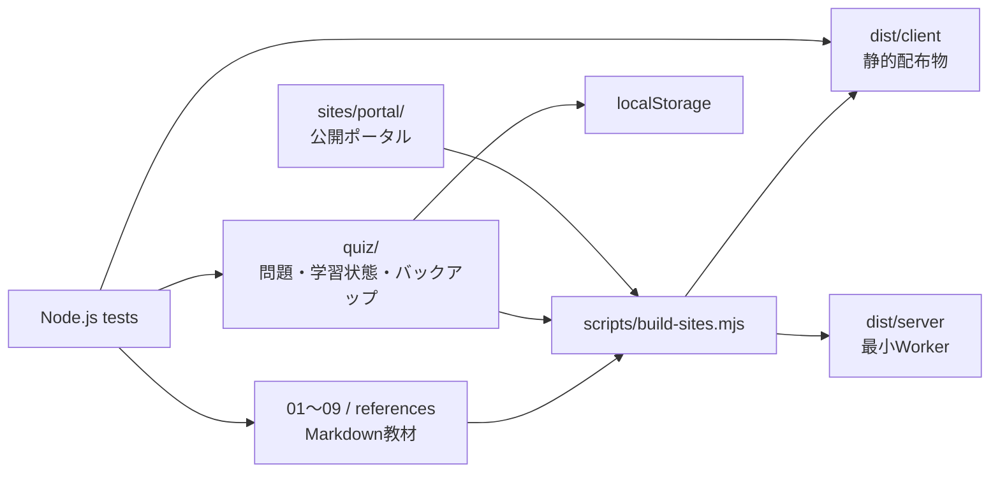

# Architecture

## 概要

AWS SAA-C03 Studyは、Markdown教材と静的な問題演習をNode.jsのbuildスクリプトで一つの公開サイトへまとめる構成です。サーバー側の学習アカウントやデータベースを持たず、回答履歴はブラウザの `localStorage` に保存します。

## 構成

## 主な責務

- `01-start-here.md` 〜 `09-visual-review.md` — 学習順に沿った教材
- `references.md` — AWS公式資料と補助資料
- `quiz/questions.js` — 105問の問題データ
- `quiz/learning-state.js` — 回答履歴・弱点集計
- `quiz/backup.js` — JSONバックアップと復元
- `sites/portal/` — 公開サイトの入口
- `scripts/build-sites.mjs` — Markdown変換、問題資産コピー、静的成果物生成
- `scripts/serve-local.mjs` — ローカル確認用HTTPサーバー
- `scripts/test-sites.mjs` — 配布物と公開教材の不変条件
- `scripts/test-public-ux.mjs` — 公開導線のUX契約

## データ境界

- 学習履歴はブラウザ内に保存し、外部アカウントを必須にしません。
- JSONバックアップは端末移行のための明示操作として提供します。
- 固定の受験予定日や個人模試結果は教材データへ含めません。
- AWS仕様の判断は [references.md](../references.md) の公式資料を優先します。

## 公開成果物

`node scripts/build-sites.mjs` は `dist/` を再生成します。公開対象は静的クライアントと最小Workerで、build時に教材・画像・問題資産の必要部分だけをコピーします。

ホスティング固有のproject IDは `.openai/hosting.json` に閉じ込め、人向けドキュメントへ重複記載しません。
